# Overview
Streamlit exploratory clustering web application


# Setup

## Local

To set things up to run locally.

```bash
# set up virtual environment
pyenv virtualenv 3.11.7 st-clustering
pyenv local st-clustering

# install
git clone git@github.com:mrperkett/st-clustering.git
cd st-clustering/
python3 -m pip install --upgrade pip
python3 -m pip install -r requirements.txt
```

## Docker

To run the docker container.

```bash
# build the docker image
docker build -t st-clustering .

docker run -p 8501:8501 st-clustering
# view website at http://localhost:8501/
```

# Deploy to Cloud

Instructions for deploying to Azure are below

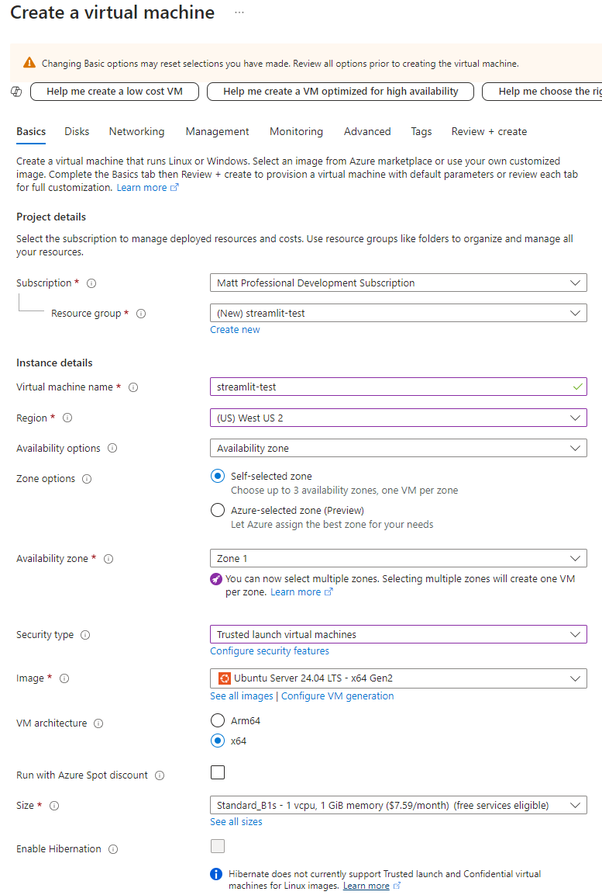

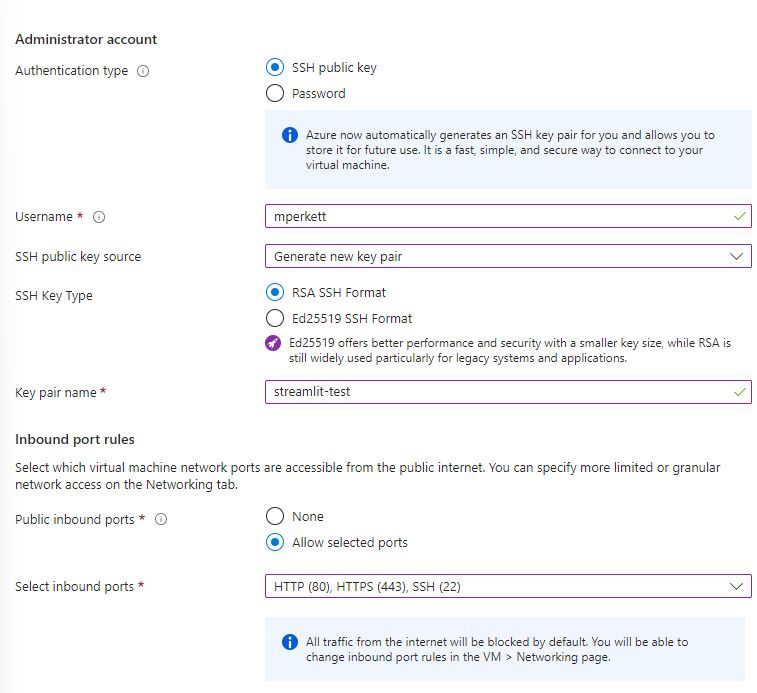

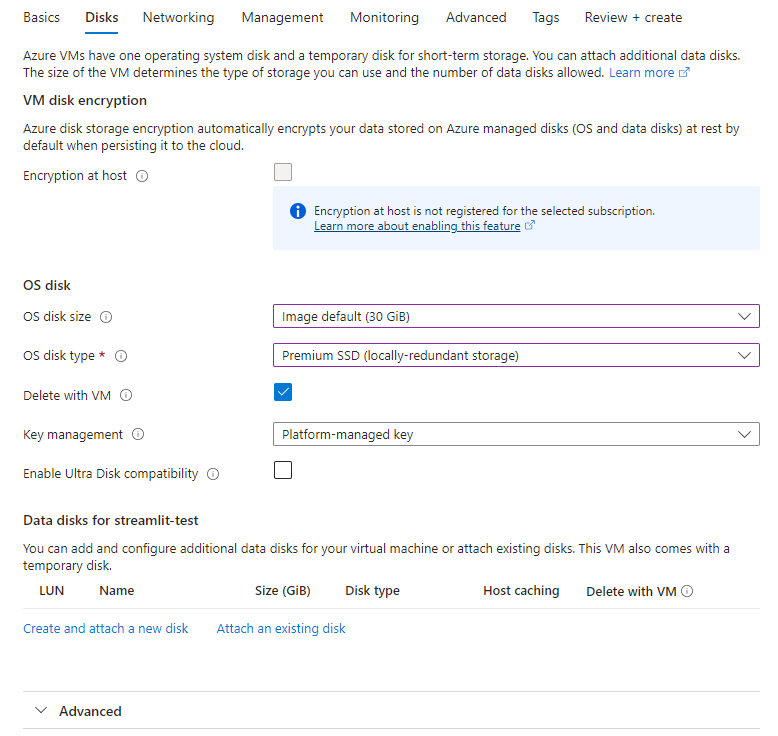

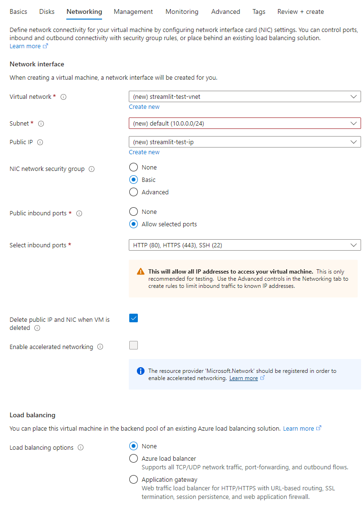

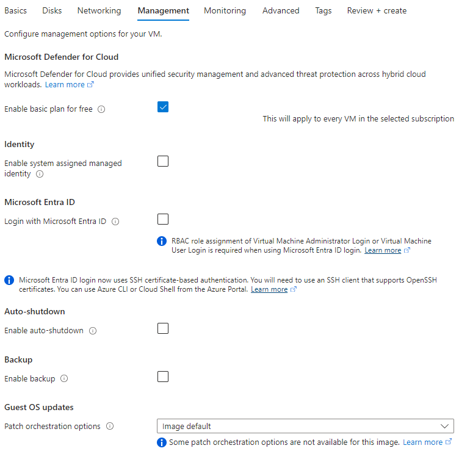

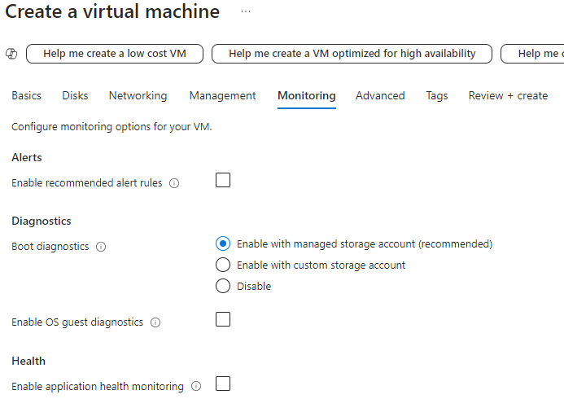

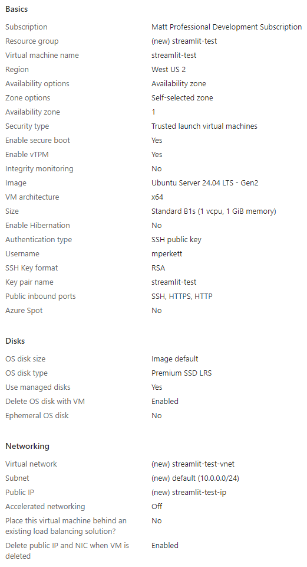

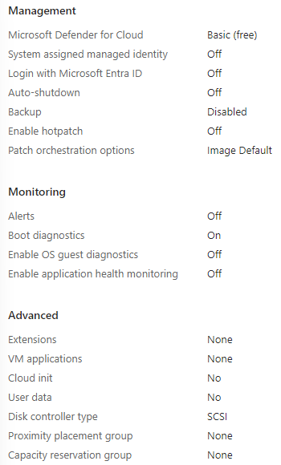

After creating the VM, you will be prompted to download a `.pem` file with the credentials.

move `streamlit-test.pem` to .ssh

After the resource is created, added a rule allowing inbound traffic on port 8501

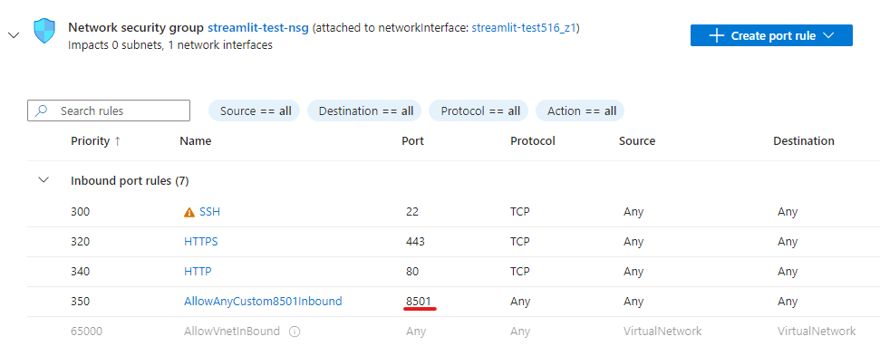

Or on multiple ports if you plan to expose multiple ports

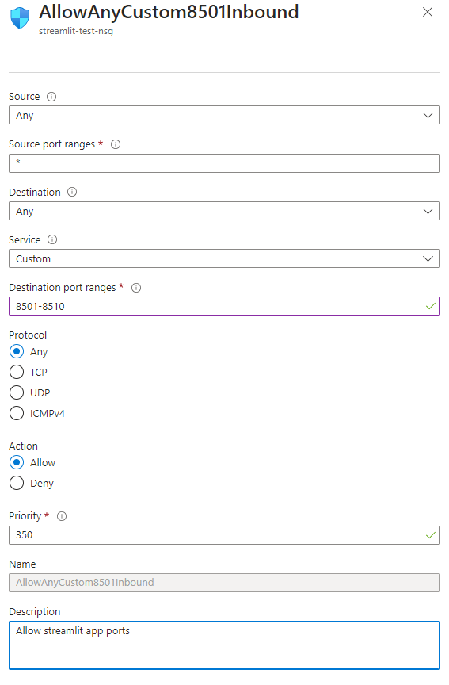

Find Public IP address under VM in Azure portal.

```bash
ssh mperkett@<public-ip-address> -i ~/.ssh/streamlit-test.pem
```

- https://docs.docker.com/engine/install/ubuntu/
- https://docs.docker.com/engine/install/linux-postinstall/

```bash
sudo apt-get update
sudo apt-get install vim curl -y

# Add Docker's official GPG key:
sudo apt-get update
sudo apt-get install ca-certificates curl
sudo install -m 0755 -d /etc/apt/keyrings
sudo curl -fsSL https://download.docker.com/linux/ubuntu/gpg -o /etc/apt/keyrings/docker.asc
sudo chmod a+r /etc/apt/keyrings/docker.asc

# Add the repository to Apt sources:
echo \
  "deb [arch=$(dpkg --print-architecture) signed-by=/etc/apt/keyrings/docker.asc] https://download.docker.com/linux/ubuntu \
  $(. /etc/os-release && echo "$VERSION_CODENAME") stable" | \
  sudo tee /etc/apt/sources.list.d/docker.list > /dev/null
sudo apt-get update

# Install the Docker packages.
sudo apt-get install docker-ce docker-ce-cli containerd.io docker-buildx-plugin docker-compose-plugin

# Verify that the Docker Engine installation is successful by running the hello-world image.
sudo docker run hello-world

# Add user to docker group so that we don't need to use `sudo docker`
sudo groupadd docker
sudo usermod -aG docker $USER
newgrp docker
# NOTE: may be necessary to reboot or log out and in at this point

# Verify that you can run docker commands without sudo.
docker run hello-world
```

Clone the repo and build a docker image.

```bash
# clone repo
git clone https://github.com/mrperkett/st-clustering.git

# build the docker image
# will take ~3 mins
cd st-clustering/
docker build -t st-clustering .

docker run -p 8501:8501 st-clustering
```

You should see something like this when it starts

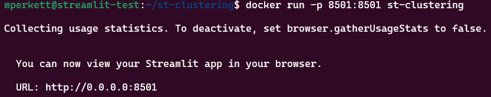

Go to the website to view it at http://localhost:8501/

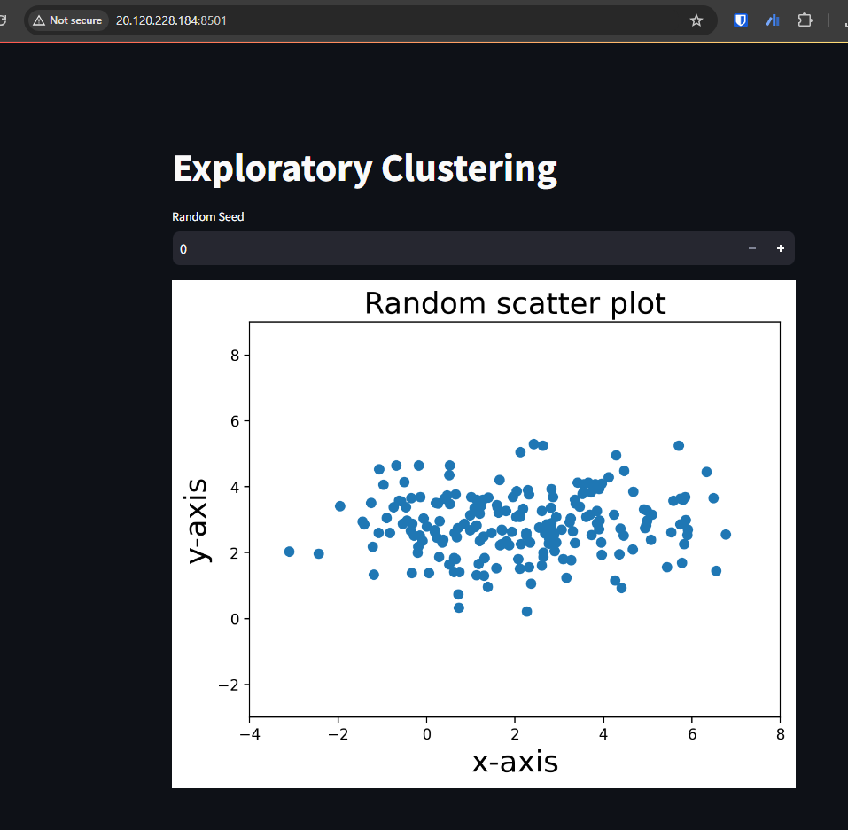


To run in the background

```bash
docker run --detach -p 8501:8501 st-clustering
```

You will get a hash back that you can use to view the process and stop it

```shell
$ docker ps
CONTAINER ID   IMAGE           COMMAND                  CREATED         STATUS         PORTS                                       NAMES
f69d3b34280d   st-clustering   "streamlit run explo…"   2 minutes ago   Up 2 minutes   0.0.0.0:8501->8501/tcp, :::8501->8501/tcp   elastic_wing
$ docker stop f69d3b34280d
$ docker ps
CONTAINER ID   IMAGE     COMMAND   CREATED   STATUS    PORTS     NAMES
```


## Add another web app

```bash
git clone https://github.com/mrperkett/st-drug-moa.git
cd st-drug-moa/
docker build -t st-drug-moa .
docker run --detach -p 8502:8502 st-drug-moa
```

Go to the website to view it at http://<your-azure-ip>:8502/


## Use NGINX to improve mutiple apps setup

```bash
sudo apt-get install nginx
sudo vi /etc/nginx/sites-enabled/default
# see below for edits
sudo nginx -s reload
```

```shell
$ sudo vi /etc/nginx/sites-available/streamlit_test
$ sudo ln -s /etc/nginx/sites-available/streamlit_test /etc/nginx/sites-enabled/
$ sudo nginx -t
nginx: the configuration file /etc/nginx/nginx.conf syntax is ok
nginx: configuration file /etc/nginx/nginx.conf test is successful
$ sudo systemctl restart nginx
```

Contents of `/etc/nginx/sites-available/streamlit_test`

```
server {
    listen 80;
    server_name <ip_address>;

    location /clustering/ {
        proxy_pass http://localhost:8501/;
        proxy_set_header Host $host;
        proxy_set_header X-Real-IP $remote_addr;
        proxy_set_header X-Forwarded-For $proxy_add_x_forwarded_for;
        proxy_set_header X-Forwarded-Proto $scheme;
        rewrite ^/clustering(/.*)$ $1 break;
    }

    location /moa/ {
        proxy_pass http://localhost:8502/;
        proxy_set_header Host $host;
        proxy_set_header X-Real-IP $remote_addr;
        proxy_set_header X-Forwarded-For $proxy_add_x_forwarded_for;
        proxy_set_header X-Forwarded-Proto $scheme;
        rewrite ^/moa(/.*)$ $1 break;
    }
}
```

Some of the resources that I referenced when setting this up

- https://gist.github.com/soheilhy/8b94347ff8336d971ad0
- https://docs.nginx.com/nginx/admin-guide/web-server/reverse-proxy/
- https://www.digitalocean.com/community/tutorials/how-to-configure-nginx-as-a-reverse-proxy-on-ubuntu-22-04

Other useful commands

- `sudo nginx -s stop`
- `sudo nginx -s reload`
- `sudo nginx -s start`


